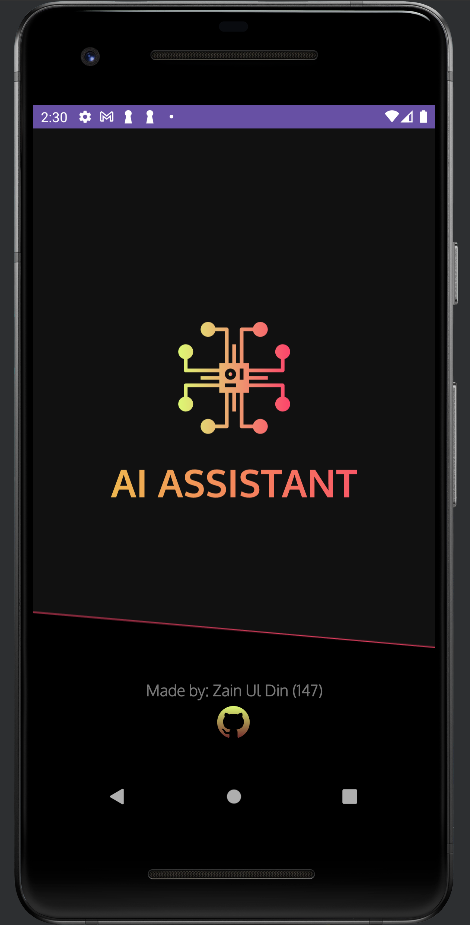
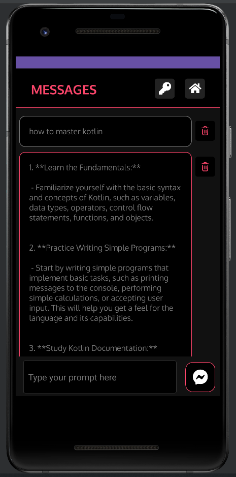
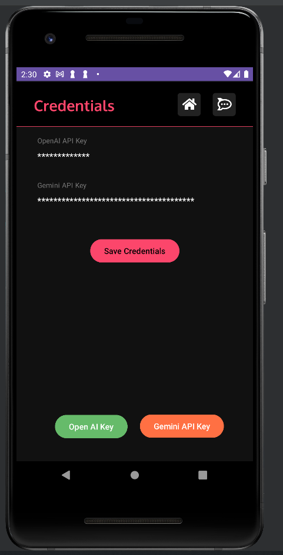

## AI Assistant App

AI Assistant App build using kotlin for my university App development course project.

## Getting Started

- Download code or `clone` repo
- open in `Android Studio`
- install dependencies
- click on `run` btn

### Usage

- click on the `key` btn
- add `Gemini` and `OpenAI` key
- click on `save credentials`

## Screen Shots

